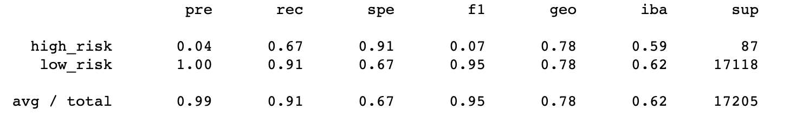

# Credit Risk Analysis

## Overview

The following is an analysis of balanced accuracy score, precision, and recall of six different algorithms trained to predict credit risk based on LendingClub credit data. Methods tested include oversampling by random oversampling and synthetic minority oversampling technique (SMOTE), undersampling using cluster centroid undersampling, combination over and undersampling using the SMOTE and Edited Nearest Neighbors (SMOTEENN) algorithm, and the Balanced Random Forest and EasyEnsemble algorithms, two machine learning models designed to reduce bias.

## Results

### Random Oversampling

* 0.65 balanced accuracy score
* precision
* recall

### SMOTE

* 0.62 balanced accuracy score
* 0.01 precision predicting high risk loans
* 0.61 recall predicting high risk loans

### Cluster Centroid Undersampling

* 0.51 balanced accuracy score
* 0.01 precision predicting high risk loans
* 0.62 recall predicting high risk loans

### SMOTEENN

* 0.61 balanced accuracy score
* 0.01 precision predicting high risk loans
* 0.69 recall predicting high risk loans

### Balanced Random Forest

* 0.79 balanced accuracy score
* 0.04 precision predicting high risk loans
* 0.67 recall predicting high risk loans

### EasyEnsemble

* 0.92 balanced accuracy score
* 0.07 precision predicting high risk loans
* 0.91 recall predicting high risk loans

## Summary

There is a summary of the results (2 pt)
There is a recommendation on which model to use, or there is no recommendation with a justification (3 pt)
